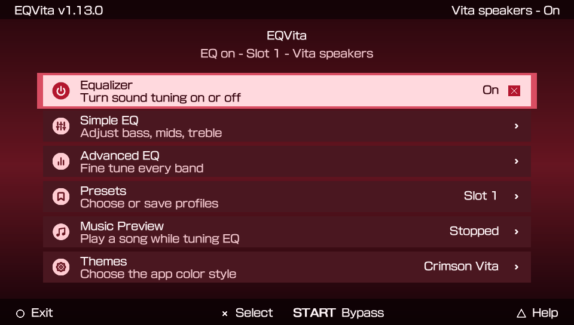
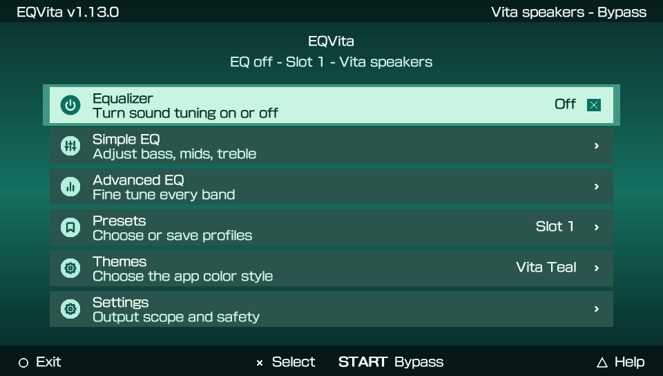
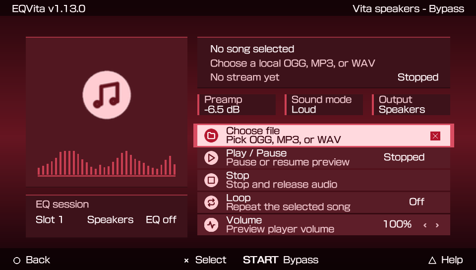

<p align="center">
  
</p>

---

<p align="center">
  A PS Vita system-wide equalizer for speakers, wired headphones, and Bluetooth.
</p>

<p align="center">
  <a href="https://github.com/shev0k/EQVita/actions/workflows/host-tests.yml"></a>
  <a href="https://github.com/shev0k/EQVita/releases"></a>
  <a href="https://www.rinnegatamante.eu/vitadb/#/info/1353"></a>
  <a href="LICENSE"></a>
  
  
</p>

EQVita is a hobby homebrew project made to give the Vita a richer sound. It ships as a kernel plugin plus a small Vita app.

Install it, open the app, pick a preset, and make the Vita sound less flat.
Nerd version: the plugin hooks `sceAudioOutOutput`, while the app handles presets, route hints, themes, logs, and boot state.

Current app/plugin ABI: `1.13.0`.

Questions, setup help, preset sharing, and random EQVita ideas live in [Discussions](https://github.com/shev0k/EQVita/discussions). Issues are better for actual bugs with logs and steps.

## Official Builds

Only builds from [shev0k/EQVita](https://github.com/shev0k/EQVita) are official.

If someone reuploads EQVita somewhere else, treat it as unofficial. Compare release checksums when available, and do not install random VPK/plugin reuploads from people you do not trust.

This project is licensed under `GPL-3.0-or-later`, but a license does not magically make every fork or reupload safe.

## App Preview

A quick walk through the app, slow enough to actually read instead of getting speedrun jumpscared.

<p align="center">
  
</p>

## Themes

The theme switcher exists because staring at EQ sliders should at least look clean.

<p align="center">
  
</p>

## Features

- 10-band graphic EQ from `31 Hz` to `16 kHz`.
- Simple EQ mode for bass, mids, treble, and preamp.
- Advanced EQ mode for every band and preamp.
- Built-in `STOCK Depth` and `MOD Switch` presets.
- Preset slots with save/load support.
- Music Preview for playing a local `OGG`, `MP3`, or `WAV` while tuning EQ.
- Speaker-only mode or all-output mode for wired/Bluetooth too.
- Optional HPF (Bass guard), which cuts very low rumble.
- Safe, Loud, and Direct headroom modes.
- Vita-style app UI with themes. `Crimson Vita` is the default.
- Boot persistence through `ur0:data/eqvita/boot.eqbs`.
- App log at `ur0:data/eqvita/app.log`.

## Download And Install

Download the latest release from [GitHub Releases](https://github.com/shev0k/EQVita/releases).

You need both files from the same release:

- `EQVita.vpk`
- `eq_speaker.skprx`

Install steps:

1. Copy `eq_speaker.skprx` to `ur0:tai/`.
2. Add it under `*KERNEL` in `ur0:tai/config.txt`:

   ```text
   *KERNEL
   ur0:tai/eq_speaker.skprx
   ```

3. Reboot the Vita.
4. Install `EQVita.vpk`.
5. Open EQVita and pick a preset.

Keep the app and plugin from the same release. Mixed versions can fail or behave weirdly.

## Controls

| Control | Action |
| --- | --- |
| D-pad / left stick | Move through rows |
| Left / Right | Adjust selected value |
| L / R | Bigger EQ value changes |
| Cross | Select, toggle, or activate |
| Circle | Back / exit from main menu |
| Start | Quick EQ on/off |
| Triangle | Help |
| Touch | Tap rows or drag lists |

EQVita follows the Vita enter-button setting for Cross/Circle.

## Presets And Data

EQVita stores data in:

```text
ur0:data/eqvita/
```

Files you may see there:

- `preset0.eqvp`, `preset1.eqvp`, `preset2.eqvp` - preset slots.
- `boot.eqbs` - boot state.
- `theme.cfg` - selected app theme.
- `app.log` - useful log for bug reports.

There are three preset slots. EQ changes apply live, and saving writes the current settings into the selected slot.

The built-in presets are starting points. Applying `STOCK Depth` or `MOD Switch` saves that preset into the active slot and startup state.

Small warning: every Vita, speaker mod, headphone, and Bluetooth setup is different. Blindly copying my bass-heavy presets can cause clipping or ugly distortion on your setup. If that happens, lower preamp first.

If you make a preset that sounds nice, please share it in this repo's [Discussions](https://github.com/shev0k/EQVita/discussions). Over time, it would be cool to build a small preset library from real user setups instead of pretending one preset fits everything.

The boot state is what lets the plugin load your saved sound after reboot, before you open the app again.

Old raw `preset%d.bin` files are imported read-only when a matching `.eqvp` file does not exist.

## Music Preview

The app can play a local song while you tune EQ.

<p align="center">
  
</p>

Put an `OGG`, `MP3`, or `WAV` file somewhere on your Vita, open `Music Preview`, choose the file, then adjust EQ like normal.

Notes:

- No music is bundled in the VPK.
- `ux0:music/` is shown as a shortcut in the file picker when available.
- Preview playback stops and releases the audio port when you stop it or close EQVita.
- This is only for tuning. It is not trying to replace your normal music player.

## Output Modes

`Vita speakers` mode applies EQ only to the Vita speakers.

`All outputs` mode also allows wired headphones and Bluetooth output.

If EQ is bypassed, the app tries to show why. Common reasons are:

- EQ is turned off.
- The selected output mode does not match the current route.
- The output port is unknown or busy.
- The audio format is unsupported.
- The app and plugin ABI do not match.

Short bypasses can happen when the Vita opens, closes, or reconfigures audio ports. If it is quick and does not sound bad, it is usually fine.

## Troubleshooting

<details>
<summary><strong>I changed EQ but hear no difference.</strong></summary>

Check that EQ is on, the output mode matches what you are using, and the app/plugin versions match.

</details>

<details>
<summary><strong>Music Preview does not show my file.</strong></summary>

Only `OGG`, `MP3`, and `WAV` files are shown. Try putting the file under `ux0:/music/` or another normal folder on your memory card.

</details>

<details>
<summary><strong>Music Preview cannot play a file.</strong></summary>

Try another file first. For WAV, use normal 16-bit PCM. If it still fails, open EQVita once more and share `ur0:data/eqvita/app.log`.

</details>

<details>
<summary><strong>Music Preview says Playing but I hear nothing.</strong></summary>

Stop the preview, try the file again, then open EQVita once more before sharing the log. The useful line is `preview-buffer`; if `output_max_us` stays at `0`, mention that in the issue.

</details>

<details>
<summary><strong>I hear crackle, static, or distortion.</strong></summary>

Try a safer preset or lower preamp first. If it still happens, save `ur0:data/eqvita/app.log` and describe what was playing.

</details>

<details>
<summary><strong>The app says ABI mismatch.</strong></summary>

Install the VPK and plugin from the same release.

</details>

<details>
<summary><strong>Where is the log?</strong></summary>

```text
ur0:data/eqvita/app.log
```

Important: the app writes fresh status/log data when EQVita opens. If something weird happens in a game or on the home screen, open EQVita once before sending the log.

</details>

For deeper testing, see [docs/testing/hardware-test-checklist.md](docs/testing/hardware-test-checklist.md), [docs/audio/audio-stability.md](docs/audio/audio-stability.md), and [docs/audio/known-limits.md](docs/audio/known-limits.md).

## Build From Source

Install [VitaSDK](https://vitasdk.org/) first.

On Windows, use WSL:

```powershell
.\scripts\build-wsl.ps1 -Clean
```

From WSL/Linux:

```bash
EQVITA_ARTIFACT_DIR=build EQVITA_BUILD_TYPE=Release bash scripts/build-wsl.sh
```

Build outputs:

- `build/plugin/eq_speaker.skprx`
- `build/app/EQVita.vpk`

Host tests:

```bash
EQVITA_BUILD_TYPE=Debug bash scripts/test-host-wsl.sh
```

Release checks:

```powershell
.\scripts\check-release-hygiene.ps1
```

More detail: [docs/build/how-to-build.md](docs/build/how-to-build.md).

UI, theme, icon, and README media notes live in [docs/app/ui-design.md](docs/app/ui-design.md), [docs/app/themes-and-icons.md](docs/app/themes-and-icons.md), and [docs/app/readme-media.md](docs/app/readme-media.md).

## Repo Layout

- `plugin/` - kernel plugin and audio hook code.
- `app/` - Vita companion app, UI, themes, LiveArea assets, and persistence.
- `common/` - shared app/plugin ABI, presets, and boot-state helpers.
- `tests/` - host-side regression tests.
- `docs/` - indexed build, release, audio, and hardware testing notes.
- `scripts/` - Windows/WSL helper scripts.

## Testing

Run host tests before every commit.

Before publishing binaries, test on real Vita hardware:

- speakers;
- wired headphones if available;
- Bluetooth if available;
- home screen sounds;
- games during loading screens;
- suspend/resume;
- reboot with the plugin enabled.

Kernel audio hooks can pass host tests and still behave differently on a real Vita. That is just how this stuff goes.

Use [docs/testing/hardware-test-checklist.md](docs/testing/hardware-test-checklist.md) before tagging or sharing builds.

## License

EQVita is licensed under the GNU General Public License, version 3 or later.

See [LICENSE](LICENSE).

Third-party asset notes live in [app/assets/THIRD_PARTY_NOTICES.md](app/assets/THIRD_PARTY_NOTICES.md).

## Credits

Created by shevoK.

Built with VitaSDK, taiHEN, vita2d, and Feather Icons.
